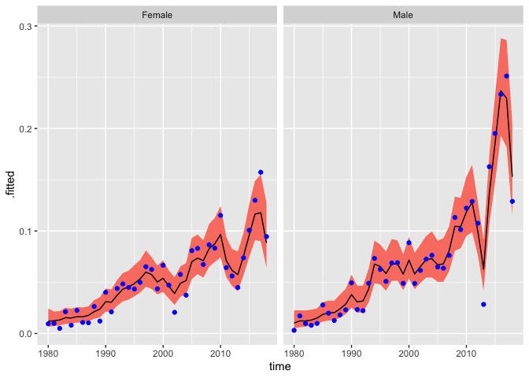

<!-- README.md is generated from README.Rmd. Please edit that file -->

# BayesRates

<!-- badges: start -->
<!-- badges: end -->

Using Bayesian methods, smooth demographic rates over age and time.
Internally, calculations are done using
[TMB](https://CRAN.R-project.org/package=TMB).

## Installation

Install the development version of BayesRates from
[GitHub](https://github.com/) with:

``` r
# install.packages("devtools")
devtools::install_github("junnizhang/BayesRates")
```

## Example

``` r
library(BayesRates)
library(ggplot2)
```

Smooth Chinese data on divorce rates

``` r
library(BayesRates)
results <- smooth_agetime(nevent_df = cn_divorces,
                          py_df = cn_population,
                          spec_time = TimeFixed(),
                          byvar = "sex")
results
#> --- Object of class "BayesRates_results" ---
#> 
#>      nevent ~ Poisson(rate * py)
#>   log(rate) = age_effect + time_effect
#>  age_effect ~ Spline()
#> time_effect ~ TimeFixed()
#> 
#>    agevar: age
#>   timevar: time
#>     byvar: sex
#>    n_draw: 1000
```

Extract rates

``` r
rates <- augment(results)
head(rates)
#> # A tibble: 6 × 10
#>     age sex     time nevent    py .fitted  .lower  .upper .probability .observed
#>   <int> <chr>  <int>  <int> <dbl>   <dbl>   <dbl>   <dbl> <list>           <dbl>
#> 1    15 Female  1980      0  489. 8.89e-6 2.66e-6 3.28e-5 <dbl>                0
#> 2    15 Female  1981      0  494. 9.23e-6 2.95e-6 2.92e-5 <dbl>                0
#> 3    15 Female  1982      0  462. 9.65e-6 3.06e-6 3.38e-5 <dbl>                0
#> 4    15 Female  1983      0  496. 1.14e-5 3.57e-6 3.99e-5 <dbl>                0
#> 5    15 Female  1984      0  496. 1.09e-5 3.69e-6 3.65e-5 <dbl>                0
#> 6    15 Female  1985      0  514. 1.20e-5 3.97e-6 4.06e-5 <dbl>                0
```

Calculate ‘total divorce rate’, and plot it

``` r
total_divorce_rate <- total_rate(results)
ggplot(total_divorce_rate,
       aes(x = time, y = .fitted, ymin = .lower, ymax = .upper)) +
  facet_wrap(vars(sex)) +
  geom_ribbon(fill = "salmon") +
  geom_line() +
  geom_point(aes(y = .observed), col = "blue")
```


